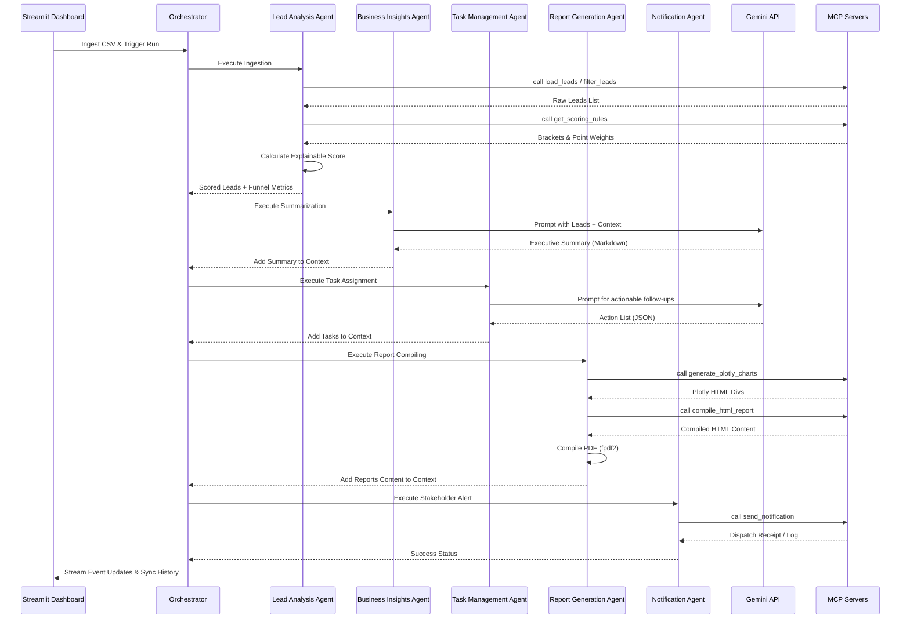

# Architecture Documentation: BusinessPilot AI

This document details the system design, agent orchestration sequence, Model Context Protocol (MCP) transport, and database state of BusinessPilot AI.

---

## 1. Multi-Agent Orchestration Sequence

We employ a sequenced orchestration pattern. The orchestrator calls each agent sequentially, passing the runtime context dictionary from step to step:



---

## 2. Model Context Protocol (MCP) Boundary

Our integration separates planning from execution:
- **Client**: The Python runtime wraps our agents and base agent class.
- **Server**: Four separate FastMCP Python servers run as isolated subprocesses spawned by the `MCPManager` class.
- **Communication**: Subprocesses communicate over standard input/output (`stdio`) pipes. The client sends JSON-RPC requests to run registered tools, and the servers send JSON-RPC responses.

### Active Servers & Tools Registry
1. **Lead Data Server** (`mcp_servers/lead_data_server.py`)
   - `load_leads(csv_path)`: Returns raw lead dictionaries.
   - `filter_leads(csv_path, industry, priority_tier)`: Queries leads list.
   - `get_lead_stats(csv_path)`: Computes base metrics (average revenue, counts).
2. **Business Knowledge Server** (`mcp_servers/business_knowledge_server.py`)
   - `get_scoring_rules()`: Fetches point brackets.
   - `get_industry_benchmarks()`: Fetches standard thresholds.
   - `get_qualification_guidelines()`: Fetches advisory markdown.
3. **Reporting Server** (`mcp_servers/reporting_server.py`)
   - `generate_plotly_charts(leads_json)`: Returns HTML chart codes.
   - `compile_html_report(summary, metrics, leads, tasks)`: Generates report HTML page.
4. **Notification Server** (`mcp_servers/notification_server.py`)
   - `send_notification(recipient, message)`: Simulates alert or emails stakeholder via SMTP.

---

## 3. Persistent Data Schemas

### Execution Record Schema (`data/history/{run_id}.json`)
Each execution writes a JSON file with this format:
```json
{
  "run_id": "RUN_20260616_120530",
  "timestamp": "2026-06-16 12:05:30",
  "dataset_name": "sample_leads.csv",
  "dataset_path": "data/sample_leads.csv",
  "metrics": {
    "total_leads": 40,
    "hot_leads": 12,
    "total_revenue": 14500000.0,
    "avg_score": 58.4
  },
  "leads": [
    {
      "company_name": "Acme Corp",
      "industry": "SaaS",
      "score": 85,
      "priority_tier": "Hot",
      "score_explanation": {
        "revenue": { "points": 30, "value": 12000000.0, "description": "High Value" },
        "employees": { "points": 15, "value": 450, "description": "Mid Market" },
        "interactions": { "points": 20, "value": 8, "description": "High Interest" },
        "conversion_rate": { "points": 20, "value": 0.45, "description": "Likely" },
        "total_unfiltered": 85,
        "capped": false,
        "contributors": {
          "agents": ["Lead Analysis Agent"],
          "mcp_tools": [{"server": "Lead Data Server", "tool": "load_leads"}]
        }
      }
    }
  ],
  "tasks": [
    {
      "lead_company": "Acme Corp",
      "task_description": "Schedule custom software pricing review",
      "assignee": "Technical Sales Engineer",
      "priority": "High",
      "status": "To Do",
      "created_at": "2026-06-16 12:05:31"
    }
  ],
  "executive_summary": "## Summary...",
  "timeline": [
    { "timestamp": "...", "stage": "Initialization", "event_type": "info", "message": "..." }
  ],
  "html_report_path": "data/reports/RUN_20260616_120530_report.html",
  "md_report_path": "data/reports/RUN_20260616_120530_report.md",
  "pdf_report_path": "data/reports/RUN_20260616_120530_report.pdf",
  "html_content": "...",
  "md_content": "...",
  "status": "Success"
}
```
