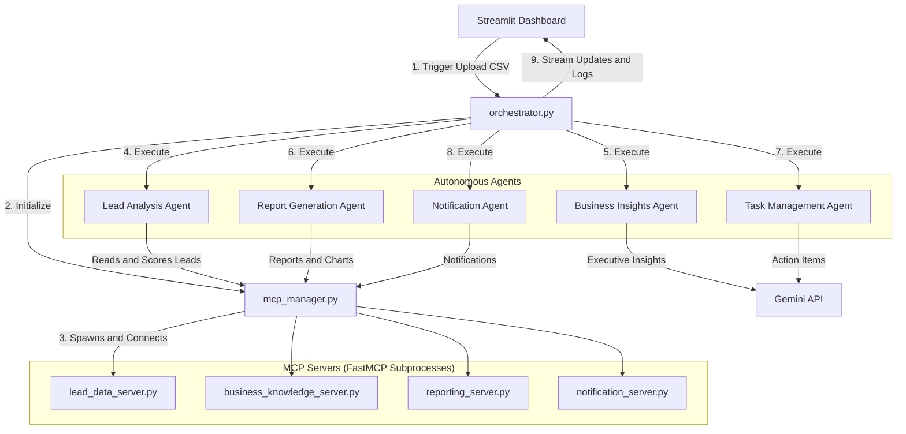

# ✈️ BusinessPilot AI: Autonomous Business Operations Platform

[](https://www.python.org/)
[](https://opensource.org/licenses/MIT)
[](https://share.streamlit.io/)
[](https://deepmind.google/technologies/gemini/)
[](https://modelcontextprotocol.org)

BusinessPilot AI is a production-quality, multi-agent business operations and lead scoring platform. Given a lead list, the system autonomously scores contacts, compiles market insights, configures interactive Kanban task boards, compiles PDF/HTML reports, and dispatches alerts to stakeholders.

The application leverages the **Model Context Protocol (MCP)** standard to decouple agent reasoning from data/system tools, running four FastMCP servers as isolated stdio RPC subprocesses.

---

## 🏛️ System Architecture


## 📁 Repository Structure

```text
├── .github/
│   ├── ISSUE_TEMPLATE/
│   │   ├── bug_report.md
│   │   └── feature_request.md
│   ├── CONTRIBUTING.md
│   └── pull_request_template.md
├── agents/
│   ├── base_agent.py            # Base agent with Gemini Client & Tool Discovery helper
│   ├── lead_analysis_agent.py   # Lead Analysis Agent (calculates XAI scores)
│   ├── business_insights_agent.py # Business Insights Agent (summarizes trends)
│   ├── task_management_agent.py # Task Management Agent (creates follow-ups)
│   ├── report_generation_agent.py # Report Generation Agent (creates reports)
│   └── notification_agent.py    # Notification Agent (handles emails)
├── config/
│   └── settings.py              # Configuration loading & API setups
├── dashboard/
│   └── app.py                   # Streamlit Dashboard UI
├── data/
│   ├── sample_leads.csv         # ~40 realistic leads
│   ├── uploads/                 # Uploaded dataset directory
│   ├── reports/                 # Stored HTML, MD, PDF reports
│   └── history/                 # Persistent execution run records
├── mcp_servers/
│   ├── lead_data_server.py      # FastMCP: Load, filter CSV leads
│   ├── business_knowledge_server.py # FastMCP: Brackets, metrics guidelines
│   ├── reporting_server.py      # FastMCP: Chart generators & HTML reports compiler
│   └── notification_server.py   # FastMCP: Simulated logger / SMTP email sender
├── orchestrator/
│   ├── mcp_manager.py           # Spawns & manages MCP Server stdio lines
│   └── orchestrator.py          # Sequencer executing agents pipeline
├── tests/
│   └── test_lead_scoring.py     # Unit test suite for lead scoring rules
├── docs/
│   ├── github_publish_guide.md  # Git repository publishing instructions
│   ├── deployment_checklist.md  # Operations & security checklists
│   ├── streamlit_deployment.md  # Streamlit Community Cloud hosting guide
│   ├── demo_assets.md           # 2min/5min demonstration scripts
│   ├── resume_description.md    # STAR bullets for recruiters
│   ├── project_story.md         # Origin narrative & design choices
│   └── screenshots/             # Guidelines for portfolio visual captures
├── Dockerfile                   # Docker image setup
├── docker-compose.yml           # Docker Compose volume mounts
├── verify_requirements.py       # Configuration and dependency validator
└── requirements.txt             # Pip dependencies
```

---

## 🚀 Key Features

1. **Multi-Agent Orchestration**: Sequenced orchestration tracking event logs, tool calls, and agent step durations.
2. **Model Context Protocol**: Local FastMCP stdio servers decoupling codebase boundaries.
3. **Explainable AI (XAI)**: Detailed scoring scorecards presenting point additions for every lead.
4. **Interactive Kanban Board**: Dynamic Kanban columns supporting card status moves synced directly to JSON history files.
5. **Persistent History Loader**: Save execution runs offline and restore charts, metrics, and logs instantly.
6. **Multi-Format Downloads**: Export HTML executive pages, Markdown files, or FPDF2-compiled PDF files.

---

## 🛠️ Local Installation

Ensure Python >= 3.10 is installed:

```bash
# Clone & Navigate
git clone https://github.com/YOUR_USERNAME/businesspilot-ai.git
cd businesspilot-ai

# Virtual Environment
python -m venv .venv
# Activate:
# On Windows:
.venv\Scripts\activate
# On macOS/Linux:
source .venv/bin/activate

# Install requirements
pip install -r requirements.txt

# Setup credentials
copy .env.example .env
# Edit .env and paste your GEMINI_API_KEY

# Validate environment
python verify_requirements.py

# Run dashboard
streamlit run dashboard/app.py
```

---

## 🐳 Docker Configuration

```bash
# Build Docker image
docker build -t businesspilot-ai .

# Build & launch with compose (retains local data directories)
docker compose up -d
```
Access the dashboard at `http://localhost:8501`.

---

## 💡 What is MCP and Multi-Agent Orchestration?

- **Model Context Protocol (MCP)**: An open-standard communication protocol by Anthropic. In typical setups, LLMs are coupled directly to custom database helper scripts. MCP isolates database, report compilation, and alerting tools into separate microservices (FastMCP Servers). The orchestrator (client) communicates with these tools over `stdio` pipes via JSON-RPC. This decouples logic, improves safety, and allows hot-swapping databases without modifying agents.
- **Multi-Agent Orchestration**: Monolithic prompts fail when handling multi-stage operations. We delegate tasks to specialized agents. Each agent receives a narrow, structured prompt, resulting in higher accuracy, lower token usage, and targeted error handlers (e.g., retrying only the notification agent without restarting lead scoring).

---

## 🗺️ Roadmap
- [ ] Connect Business Knowledge MCP Server to a live database (PostgreSQL).
- [ ] Implement Vector Database (RAG) tool searches.
- [ ] Integrate Salesforce / HubSpot MCP sync.
- [ ] Add voice briefing audio summaries.

---

## 📄 License
This project is licensed under the MIT License - see the LICENSE file for details.
